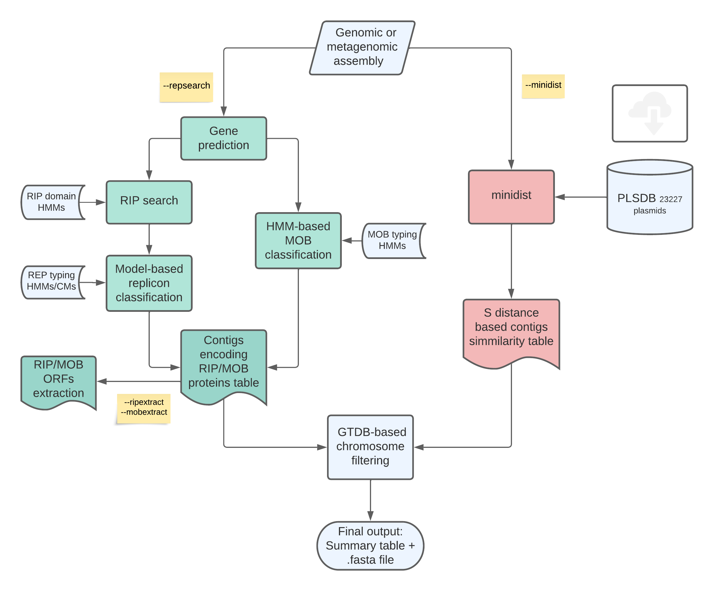

# plaSquid: **Pla**smid **S**e**q**uences **Id**entification in metagenomic assemblies.  

### Description

- **plaSquid** is a Nextflow pipeline for plasmid detection and classification in genomic and metagenomic data. This pipeline accepts either genomic or metagenomic *assemblies* as input (.fasta). It uses two different approaches to look for plasmids: alignment with minimap2 against a plasmidic database (minidist) and HMM dependent search of plasmid specific genes (Repsearch).

- **plaSquid** also classifies plasmids into replicon types and MOB groups by comparing RIPs or Relaxases against custom HMMs. 

- **plaSquid** can extract plasmids RIP or MOB sequences in order to further analyze these proteins.   

- It summarises the information gathered by the two complementary approaches in a single output table and allows further analysis on plasmidic contigs as it outputs plasmidic contigs in a multifasta file (*"Result.fasta"*)

### Installation

    git clone https://github.com/mgimenez720/plaSquid/
    cd plaSquid/
 
Using the option (*"-profile conda"*) when running plaSquid will build a conda environment within the base directory. This environment can be reused in subsequent runs.   

A docker container is also available with:
    
    docker push mgimenez720/plasquid:tagname

#### Dependencies

All dependencies are provided within the conda evironment. Manual installation is discouraged. 

[hmmer 3.3.1](http://hmmer.org/download.html),
[infernal 1.1.3](http://eddylab.org/infernal/),
[minimap2 2.17](https://github.com/lh3/minimap2),
[prodigal 2.6.3](https://github.com/hyattpd/Prodigal),
R packages:
dplyr 1.0.4,
tidyverse 1.3.0,
seqinr 4.2.5,
biostrings 2.58.0,

### Usage 

    nextflow run plaSquid.nf --contigs 'data/test.fasta' --outdir 'plaSquid_result'

    arguments:

    --contigs       Path to input data (must be surrounded with quotes).
    --mmi           Path to Minimap2 indexed (.mmi) or fasta (.fasta/.fna) plsdb database.
    --outdir        Path to output directory where results are written.
    --help          Print help message and exit

    subworkflows:

    --minidist      Run mapping of contigs against plsdb database.
    --repsearch     Run search and classification of RIP and MOB (Rel) genes.

    profiles:

    -profile conda  Installs dependencies using a conda environment
    -profile server runs using 15 cpus and 50 Gb
    -profile test   tests dependencies and normal functioning

    Authors:

    Matías Giménez
    Ignacio Ferrés
    Gregorio Iraola

    Microbial Genomics Laboratory
    Institut Pasteur Montevideo (Uruguay)

### Note

This is a beta version, please report bugs or misfunctions detected.
